# Medi-Mate: Detailed Workflow Diagrams

## 1. High-Level System Overview

---

## 2. Authentication Flow

---

## 3. Prescription Upload & Processing

---

## 4. RAG Chat Pipeline (LangGraph)

---

## 5. OTC Safety Verification (Hybrid RAG)

```mermaid
flowchart TD
    A[User Clicks OTC Check] --> B[Get Medicine Details]
    B --> C[OTCManager.check_medicines_with_llm]
    
    C --> D[For Each Medicine]
    D --> E[Vector Search in Pinecone]
    
    subgraph VectorSearch["🔍 Semantic Search"]
        F[Query: Medicine Name]
        G[Namespace: otc_medicines]
        H[Top-K: 3]
        I[Threshold: 0.7]
    end
    
    E --> F
    F --> G
    G --> H
    H --> I
    
    I --> J{Candidates Found?}
    
    J -->|No| K["Mark as 'Consult Doctor'"]
    J -->|Yes| L[LLM Verification]
    
    L --> M[Build Verification Prompt]
    M --> N["Is Medicine == Candidate?"]
    N --> O[Send to Gemini]
    
    O --> P[Parse JSON Response]
    P --> Q{is_otc: true?}
    
    Q -->|Yes| R["Add to 'Safe to Buy'"]
    Q -->|No| K
    
    R --> S[Aggregate Results]
    K --> S
    
    S --> T[Save to MongoDB]
    T --> U[Display in UI]
    
    subgraph Results["📊 Final Output"]
        V["✅ OTC Medicines"]
        W["⚠️ Consult Medicines"]
    end
    
    U --> V
    U --> W
```

---

## 6. OTC Database Initialization (Startup)

---

## 7. Complete User Journey

---

## 8. Data Flow Summary

| Step | Component | Input | Output | Storage |
|------|-----------|-------|--------|---------|
| 1 | AuthManager | Username/Password | Session Token | MongoDB |
| 2 | Extractor | PDF/Image | Structured JSON | - |
| 3 | VectorStore | Text Chunks | Embeddings | Pinecone |
| 4 | MemoryManager | Session Data | Persisted History | MongoDB |
| 5 | RAGGraph | User Query | AI Answer | - |
| 6 | OTCManager | Medicine List | Safety Classification | MongoDB (cached) |
